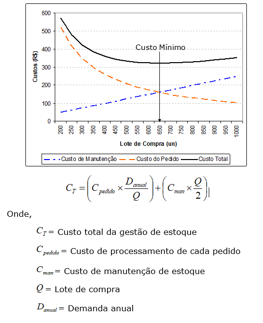
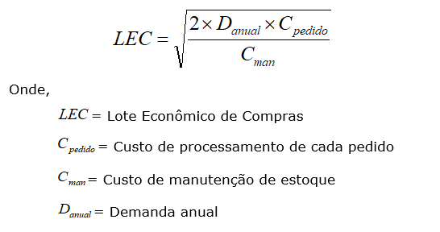
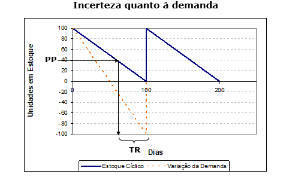
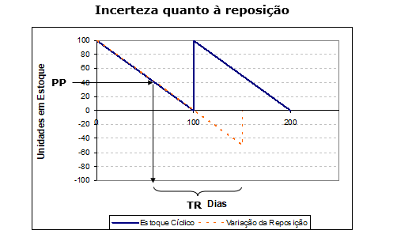
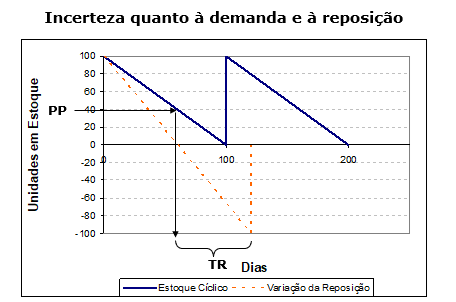
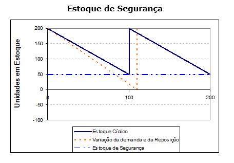

```{r child = "setup.Rmd"}
```

```{r xaringan-tile-view, echo=FALSE}
xaringanExtra::use_tile_view()
```

```{r xaringan-editable, echo=FALSE}
xaringanExtra::use_editable(expires = 1)
```

```{r xaringanExtra-clipboard, echo=FALSE}
htmltools::tagList(
  xaringanExtra::use_clipboard(
    button_text = "<i class=\"fa fa-clipboard\"></i>",
    success_text = "<i class=\"fa fa-check\" style=\"color: #90BE6D\"></i>",
    error_text = "<i class=\"fa fa-times-circle\" style=\"color: #F94144\"></i>"
  ),
  rmarkdown::html_dependency_font_awesome()
)
```

```{r xaringan-fit-screen, echo=FALSE}
xaringanExtra::use_fit_screen()
```

```{r xaringan-extra-styles, echo=FALSE}
xaringanExtra::use_extra_styles(
  hover_code_line = TRUE,         #<<
  mute_unhighlighted_code = TRUE  #<<
)
```

```{r xaringan-scribble, echo=FALSE}
xaringanExtra::use_scribble()
```


class: middle, center, inverse

## Gestão de Estoques

### Definições

Estoques são materiais ou produtos que ficam fisicamente disponíveis pela empresa, até o momento de ingressarem no processo produtivo ou seguirem para a comercialização direta ao consumidor final.

https://blog.portaleducacao.com.br/estoque-definicao-e-conceito/

---
## Gestão de Estoques

### Definições

Dentro de uma empresa, o estoque é representado por produtos (sejam eles produtos finais ou inacabados) que estão em posse de um agente econômico. São os materiais e suprimentos utilizados para a produção de seu produto ou para suprimir a necessidade da própria empresa.

https://blog.contaazul.com/glossario/estoque/

---

## Gestão de Estoques

### Definições

Estoque é a composição de materiais (matérias-primas, materiais em processamento, materiais semiacabados, materiais acabados, produtos acabados), que em determinado momento não é utilizado na empresa mas que será utilizado futuramente. Desta forma, o conceito de estoque inclui toda a variedade de materiais que empresa possui e utiliza no processo de produção de seus produtos e/ou serviços. Chiavenato (2005)

---
## Gestão de Estoques

### Definições

“Estoque é definido como a acumulação armazenada de recursos materiais em um sistema de transformação, ou também pode ser usado para descrever qualquer recurso armazenado” Slack, Chambers e Johnston (2009)


---
## Gestão de Estoques

### Tipos de estoque
- Matéria Prima
- Produtos em processamento
- Produtos acabados
- Estoque em trânsito
- Materiais de embalagem
- Estoque de componentes

---
## Gestão de Estoques

### Decisões

- Quanto pedir   
  - Custos de estoques   
  - Lote econômico de compras   

- Quando pedir   
  - Revisões contínuas e periódicas

- Estrutura e operacionalização de armazenagem

---
## Gestão de Estoques

### Objetivos

- economia financeira e maior produtividade;
- otimização do tempo, pois simplifica o processo de compras;
- evita a ruptura de estoque e gera segurança operacional;
- você conseguirá fazer uma boa negociação com os fornecedores.

---
## Gestão de Estoques

### Como realizar a gestão?
- Cálculo do nível de estoque cíclico
- Cálculo do nível de estoque de segurança
- Determinação de Lote Econômico de Compra
- Atualização de inventário
- Replanejamento do suprimento
- Determinação do ponto de pedido
- Recebimento e armazenagem de materiais
- Conservar material em condições adequadas
- Entregar material mediante requisição
- Documentação
- Organização do almoxarifado

---

## Gestão de Estoques

### Lote Econômico de Compras

Trade-off entre custos de manutenção de estoque e custos de reposição (transporte)

```{r echo=FALSE, message=FALSE, warning=FALSE}

```


---
## Gestão de Estoques

### Lote Econômico de Compras
```{r echo=FALSE, message=FALSE, warning=FALSE}

```

---
## Gestão de Estoques

### Lote Econômico de Compras

Considere a demanda média semanal de 100 unidades por um determinado produto. O custo de compra de cada item é R$ 2,00 por unidade. O custo de manutenção equivale a 25% do custo de compra de cada item e o custo para processamento de cada pedido é R$ 20,00. Determine o lote econômico de compras. 

---

## Gestão de Estoques

### Estoque de segurança
```{r echo=FALSE, message=FALSE, warning=FALSE}

```

---
## Gestão de Estoques

### Estoque de segurança
```{r echo=FALSE, message=FALSE, warning=FALSE}

```

---
## Gestão de Estoques

### Estoque de segurança
```{r echo=FALSE, message=FALSE, warning=FALSE}

```

---
## Gestão de Estoques

### Estoque de segurança
```{r echo=FALSE, message=FALSE, warning=FALSE}

```


---
## Gestão de Estoques

### Estoque de segurança

O nível do Estoque de Segurança é determinado pela variabilidade da demanda e da reposição. Caso sejam distribuídas segundo a distribuição normal no entorno dos valores médios, utiliza-se o conceito de desvio padrão para cálculo do nível do estoque de segurança, considerando-se a probabilidade de não atendimento (nível de serviço).

---
## Gestão de Estoques

### Como controlar o sistema   
  - Curva ABC   
  - Inventário   
  - Planejamento de estoques de segurança   
  - Simulação de demanda e reposição
  

---
class: center, middle

.huge[
**DÚVIDAS?**
]
